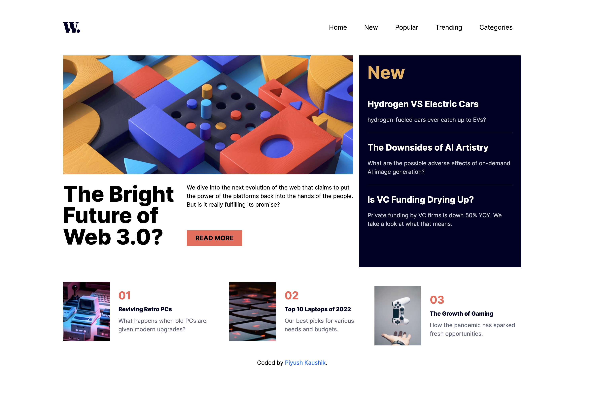

# Frontend Mentor - News homepage solution

This is a solution to the [News homepage challenge on Frontend Mentor](https://www.frontendmentor.io/challenges/news-homepage-H6SWTa1MFl)

## Table of contents

- [Overview](#overview)
  - [The challenge](#the-challenge)
  - [Screenshot](#screenshot)
  - [Links](#links)
- [My process](#my-process)
  - [Built with](#built-with)
  - [What I learned](#what-i-learned)
- [Author](#author)

## Overview

### The challenge

Users should be able to:

- View the optimal layout for the interface depending on their device's screen size
- See hover and focus states for all interactive elements on the page

### Screenshot

### Links

- Solution URL: [GitHub](https://github.com/piyush-kaushik24/news-homepage)
- Live Site URL: [News homepage](https://news-homepage-ndbb.vercel.app/)

## My process

### Built with

- Semantic HTML5 markup
- CSS custom properties
- Flexbox
- CSS Grid
- Mobile-first workflow
- [React](https://reactjs.org/) - JS library
- [Tailwind CSS](https://tailwindcss.com/) - CSS framework

### What I learned

- Practiced keeping website content in separate data files instead of hardcoding it inside components.
- Practiced breaking a webpage into reusable React components.
- Practiced rendering dynamic content using JavaScript arrays and .map().
- Learned how to manage component state using useState.
- Practiced building a responsive navigation menu with React state.
- Learned how to use conditional rendering to show and hide elements.
- Improved my understanding of managing page scrolling when a mobile navigation menu is open.

## Author

- GitHub - [@piyush-kaushik24](https://github.com/piyush-kaushik24)
- Frontend Mentor - [@piyush-kaushik24](https://www.frontendmentor.io/profile/piyush-kaushik24)
